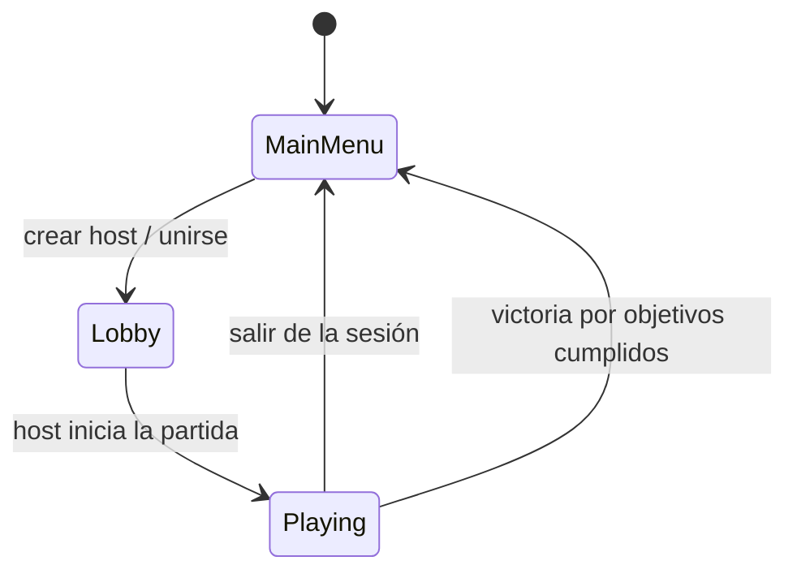
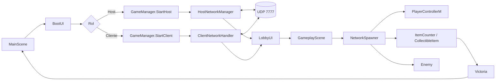

# The Lost Hill 

## Video de Muestra

[https://www.youtube.com/watch?v=0MUs7fMn4s8](https://www.youtube.com/watch?v=0MUs7fMn4s8)

## Descripción general

The Lost Hill es un juego multijugador cooperativo de terror y supervivencia desarrollado en Unity. La sesión se organiza con un host autoritativo: un jugador crea la partida, el resto entra como cliente usando IP y puerto. El estado del juego, los jugadores, el enemigo y los coleccionables se sincronizan con un protocolo propio sobre UDP.

La partida arranca en `MainScene`, donde están el menú principal, el formulario para crear o unirse a una sala y el lobby. Cuando el host inicia la partida, el flujo pasa a `GameplayScene`.

## Flujo de partida





El lobby vive dentro de la escena principal; no hay una escena de lobby separada.

## Requisitos técnicos

| Componente | Requisito |
| --- | --- |
| Motor | Unity 6000.3.8f1 |
| Lenguaje | C# |
| Red | Sockets propios sobre UDP (`System.Net.Sockets`) |
| Puerto por defecto | 7777 |
| Entrada | Unity Input System |
| UI | uGUI y TextMeshPro |
| Render | Universal Render Pipeline |
| IA y navegación | NavMesh / AI Navigation |
| Plataforma probada | Windows |

Los paquetes necesarios ya están definidos en `Packages/manifest.json`.

## Cómo ejecutar el sistema

1. Abre `Assets/Scenes/MainScene.unity`.
2. Ejecuta la escena en el editor o genera un build.
3. En una instancia, escribe el nombre del jugador y el puerto y pulsa `Create Host`.
4. En otra instancia, escribe la IP del host, el mismo puerto y pulsa `Join`.
5. Cuando ambos estén en el lobby, el host pulsa `Start Game`.

### Ejecución local y en red

- Local: usa `127.0.0.1` como IP del cliente.
- LAN: usa la IP privada del host, por ejemplo `192.168.x.x`.
- Red externa: abre el puerto UDP `7777` en el firewall y en el router si hace falta.

### Controles básicos

- `WASD` o flechas: moverse.
- Mouse: mirar.
- `Shift`: correr.
- `ESC`: abrir o cerrar la pausa.
- Acción de interactuar del Input System: recoger objetos.

---

## Capturas

### Menú principal


### Lobby


### Pausa


### Victoria


### Partida


---

## Funcionalidades implementadas

- Creación de partidas como host y unión como cliente con nombre, IP y puerto.
- Lobby con lista de jugadores, ping visible y botón de inicio solo para el host.
- Gestión de desconexiones, rechazo por servidor lleno, IP baneada o versión incompatible.
- Reconexión automática del cliente con retroceso exponencial.
- Movimiento en primera persona con sprint, cámara y animaciones.
- Recogida de objetos con contador sincronizado y condición de victoria.
- Enemigo controlado por el host con patrulla, alerta y persecución sobre NavMesh.
- Pausa global sincronizada, expulsión de jugadores y baneo persistente por IP.
- HUD de juego y cambio de estados `MainMenu -> Lobby -> Playing -> MainMenu`.
- Respawn del jugador tras captura por el enemigo.

---

## Red y sincronización

- El juego no depende de Mirror ni de Netcode for GameObjects para la partida principal.
- El host valida el estado de la sesión y difunde cambios a los clientes.
- Los jugadores remotos se suavizan con interpolación y predicción local.
- El ping, la reconexión y los timeouts están integrados en el cliente.
- La lista de baneos se guarda en el host para conservar las IP bloqueadas entre sesiones.

---

## Limitaciones conocidas

- No hay host migration; si el host se cierra, la sesión termina.
- La red no usa cifrado ni autenticación adicional.
- El timeout de desconexión es corto (5 s), así que una conexión inestable puede expulsar clientes.
- `GameRulesUI` está preparado, pero todavía no aplica cambios reales al host.
- `ResultsUI` tiene la interfaz creada, pero la lógica de reinicio y regreso al lobby sigue pendiente.
- La partida no tiene una escena de lobby separada; el lobby se muestra dentro de `MainScene`.

---

## Estructura del proyecto

<details>
<summary>Ver estructura de scripts</summary>

```text
Assets/Scripts/
├── Admin/
│   ├── AdminController.cs
│   ├── BanSystem.cs
│   ├── KickSystem.cs
│   └── PauseSystem.cs
├── Core/
│   ├── Constants.cs
│   ├── GameManager.cs
│   ├── GameStateMachine.cs
│   └── SceneLoader.cs
├── Gameplay/
│   ├── Collectibles/
│   │   ├── CollectibleItem.cs
│   │   └── CollectibleManager.cs
│   ├── CollectibleItem.cs
│   ├── Monster/
│   │   └── Enemy.cs
│   ├── Player/
│   │   ├── PlayerController.cs
│   │   ├── PlayerControllerM.cs
│   │   ├── PlayerData.cs
│   │   ├── PlayerNetworkSync.cs
│   │   └── PlayerVisuals.cs
│   ├── GameRules.cs
│   ├── GameSessionManager.cs
│   ├── ItemCounter.cs
│   ├── NetworkSpawner.cs
│   ├── Pausa.cs
│   └── PickupIndicator.cs
├── Network/
│   ├── Client/
│   │   ├── ClientNetworkHandler.cs
│   │   ├── PingMonitor.cs
│   │   └── ReconnectHandler.cs
│   ├── Host/
│   │   ├── BanList.cs
│   │   ├── ClientSession.cs
│   │   ├── ConnectionRegistry.cs
│   │   └── HostNetworkManager.cs
│   ├── Shared/
│   │   ├── MessageQueue.cs
│   │   ├── NetworkMessage.cs
│   │   ├── NetworkProtocol.cs
│   │   ├── PacketSerializer.cs
│   │   └── UdpEndpointUtil.cs
│   └── Sync/
│       ├── ClientSidePrediction.cs
│       ├── ExtrapolationSystem.cs
│       └── InterpolationSystem.cs
└── UI/
    ├── Admin/
    │   ├── AdminPanelUI.cs
    │   └── GameRulesUI.cs
    ├── HUD/
    │   ├── CollectiblesProgressUI.cs
    │   ├── HUDManager.cs
    │   ├── PauseMenuUI.cs
    │   ├── PingDisplay.cs
    │   └── PlayerListUI.cs
    ├── Lobby/
    │   ├── HostSetupUI.cs
    │   ├── JoinUI.cs
    │   ├── LobbyPlayerEntry.cs
    │   └── LobbyUI.cs
    ├── Results/
    │   ├── GameOverUI.cs
    │   └── ResultsUI.cs
    ├── BootUI.cs
    └── RespawnUI.cs
```

Escenas principales:

- `Assets/Scenes/MainScene.unity`
- `Assets/Scenes/GameplayScene.unity`

---

## Scripts clave

- `Assets/Scripts/Core/GameManager.cs`: coordina el rol local y las transiciones de sesión.
- `Assets/Scripts/Core/GameStateMachine.cs`: cambia entre menú, lobby y gameplay y notifica al resto.
- `Assets/Scripts/Network/Host/HostNetworkManager.cs`: escucha clientes, responde a conexiones y emite mensajes.
- `Assets/Scripts/Network/Client/ClientNetworkHandler.cs`: conecta al host, procesa mensajes y maneja reconexión.
- `Assets/Scripts/Gameplay/NetworkSpawner.cs`: crea y sincroniza jugadores en host y cliente.
- `Assets/Scripts/Gameplay/Player/PlayerControllerM.cs`: movimiento en primera persona, interacción y respawn.
- `Assets/Scripts/Gameplay/Monster/Enemy.cs`: IA y persecución del jugador.
- `Assets/Scripts/Gameplay/ItemCounter.cs`: registra coleccionables, valida la victoria y lanza la salida al menú.
- `Assets/Scripts/UI/HUD/PauseMenuUI.cs`: abre la pausa, la sincroniza y permite salir de la sesión.
- `Assets/Scripts/UI/Lobby/LobbyUI.cs`: muestra la lista de jugadores y habilita el inicio solo al host.

## Nota de implementación

La sesión se mantiene en `MainScene` hasta que el host cambia el estado; el servidor no depende de middleware externo y la lógica se divide por módulos para mantener el flujo de red y gameplay separado.
