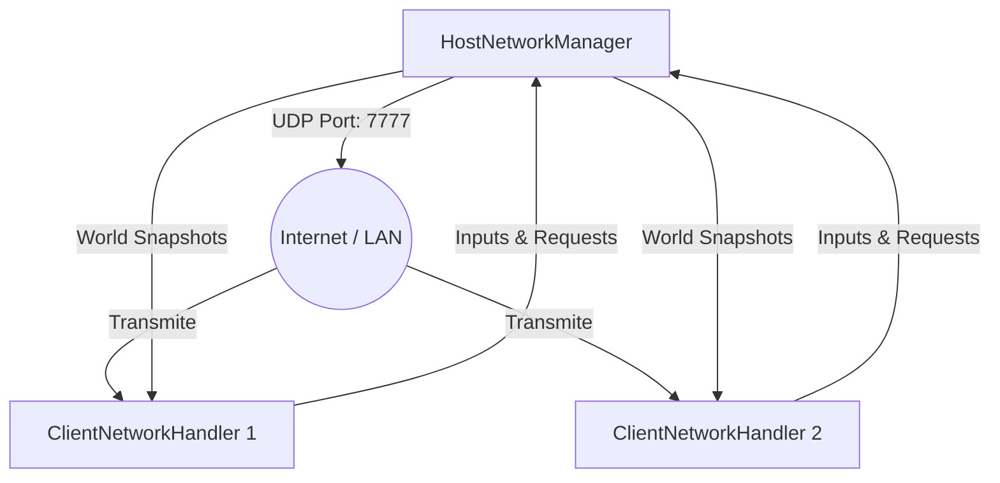

# The Lost Hill 

**The Lost Hill** es un videojuego multijugador cooperativo de terror y supervivencia desarrollado en Unity. Los jugadores deberán adentrarse en un bosque oscuro, cooperar para encontrar una serie de objetos coleccionables y sobrevivir al acecho de entidades hostiles antes de que sea demasiado tarde. 

Todo el entorno de red está construido desde cero utilizando una **arquitectura de red UDP propia (Host-Autoritativo)** que optimiza el rendimiento y sincroniza el estado del mundo de forma fluida y segura.

---

##  Tabla de Contenidos

1. [Descripción y Jugabilidad](#-jugabilidad)
2. [Interfaces de Usuario (UI)](#-interfaces-de-usuario-ui)
3. [Tecnología y Requisitos](#-tecnología-y-requisitos)
4. [Arquitectura de Red (Sistema UDP)](#-arquitectura-de-red-sistema-udp)
5. [Manejo de Errores y Seguridad](#-manejo-de-errores-y-seguridad)
6. [Estructura del Proyecto y Scripts Clave](#-estructura-del-proyecto-y-scripts-clave)
7. [Mejores Prácticas y Patrones](#-mejores-prácticas-y-patrones)

---

## Jugabilidad

- **Objetivo Principal:** El equipo debe explorar el mapa y encontrar **todos los objetos coleccionables** dispersos antes de ser atrapados.
- **Multijugador Cooperativo:** Un jugador toma el rol de **Host** (servidor local y jugador) mientras otros se unen como **Clientes**.
- **Sistema de Victoria Dinámico:** Al momento en que el grupo recoja todos los objetos configurados en el mapa, el sistema bloquea los controles, congela el tiempo, notifica la victoria a todos simultáneamente y retorna la sesión a la sala principal.

---

## Interfaces de Usuario (UI)

El juego cuenta con un flujo completo de menús escalables y adaptados para funcionar en multijugador:

### 1. Main Menu (Menú Principal)
Punto de entrada. Permite a los jugadores introducir sus credenciales y elegir si desean crear una nueva partida (Host) o conectarse a una existente apuntando a una IP (Client).
> 

### 2. Lobby (Sala de Espera)
Donde los jugadores se reúnen antes de desplegarse en el mapa.
- **Features:** Gestión de jugadores, botones de **Kick** exclusivos para el Host.
> 

### 3. In-Game HUD & Pause Menu
La interfaz limpia cuenta con contador de objetos y estados de los jugadores.
Al presionar `ESC`, se despliega un **Menú de Pausa Sincronizado**:
- Si el **Host** pausa, el juego se detiene globalmente para todos los clientes (aplicando un freno físico total).
- Los clientes solo pueden visualizar la pantalla de interrupción o abandonar la partida de forma segura.
> 

### 4. Pantalla de Victoria / Resultados
Una pantalla autogenerada por código con un *Overlay* oscuro que confirma la recolección absoluta de todos los fragmentos y devuelve automáticamente la sala al Menú.

---

## Tecnología y Requisitos

- **Motor Gráfico:** Unity (Soporte Universal Render Pipeline/HDRP - *Especificar versión*).
- **Lenguaje:** C# (.NET).
- **Entradas:** **Unity New Input System** (Basado en eventos, previene bloqueos de hardware estáticos).
- **UI:** Unity UI Toolkit / TextMeshPro.
- **Sistema Operativo Objetivo:** Windows (Optimizado para sockets Win32) / Multiplataforma.

---

## Arquitectura de Red (Sistema UDP)

El manejo multijugador no depende de *Netcode for GameObjects* ni *Mirror*, sino que ha sido **escrito puramente sobre Sockets UDP (`System.Net.Sockets`)**.

### Diagrama de Arquitectura de Red
*(Ejemplo de diagrama, puedes renderizar esto con Mermaid o reemplazar con una imagen)*



- **Host-Authoritative:** El cliente no mueve su posición; envía "Intenciones de Movimiento" (Inputs) al Host. El Host valida los colisionadores y envía de regreso las posiciones absolutas (Snapshots).
- **Snapshots Constantes:** Se utiliza una cola de mensajes encriptada en Array de *Bytes*. Se interpolan los deltapositions en los clientes para enmascarar latencia (Lag).
- **Gestión de Desconexión:** Timeouts adaptados a 5 segundos para purgar clientes fantasmas (`DisconnectMessage` y `LeaveSession`).

---

## Manejo de Errores y Seguridad

- **UDP ConnectionReset Bug (Windows 10054):** Manejo de problemas nativos de Windows donde se colapsa todo el hilo de escucha cuando un cliente realiza un "Alt+F4". Mitigado forzando el código IOControl de bajo nivel `SIO_UDP_CONNRESET` sobre el socket.
- **Thread Safety:** Las colas UDP recogen la data en un *background thread* y utilizan candados lógicos (`lock`) y delegaciones concurrentes para trasladar la manipulación de objetos al hilo principal de Unity evitando `InvalidOperationExceptions`.
- **Precausión de Estados:** Resistencia al presionado simultáneo o spam de menús. Cuando hay una desconexión bruta, la máquina de estados limpia la carga residual (`Time.timeScale` reseteado).

---

## Cumplimiento de Arquitectura (Plan vs Realidad)

El desarrollo del juego siguió estrictamente el documento de **Arquitectura y Plan de Desarrollo**, logrando implementar las fases fundamentales de redes y mecánicas:

| Fase de Desarrollo | Estado Actual | Detalles de Implementación en el Proyecto |
| :--- | :---: | :--- |
| **Fase 1: Infraestructura** | Completada | Sistema construido con `System.Net.Sockets` (UDP dominante para evitar overhead TCP). Se crearon el `HostNetworkManager`, `ClientNetworkHandler`, una `MessageQueue` Thread-Safe bidireccional y el `PacketSerializer` en binario.
| **Fase 2: Lobby y Sesiones** | Completada | Máquina de estados completa a través de `GameStateMachine.cs` (Lobby → Playing → MainMenu). Se integraron las interfaces `JoinUI`, visualización de IPs y un sistema de control de clientes (Eventos de Desconexión).
| **Fase 3: Movimiento en Red** | Completada | **Player-Host Architecture**. Los clientes usan predicción local mientras envían *Inputs* (`PLAYER_INPUT`). El servidor valida físicas y responde con deltas (`WORLD_STATE`). Se usa interpolación para mitigar el lag visual.
| **Fase 4: Gameplay (Objetos)** | Completada | Implementación determinista en `ItemCounter.cs` y `CollectibleItem.cs`. El recuento es autoritativo (validado en el Host) y radiado a clientes. *Nota: La lógica extendida del pathfinding del Monstruo está en constante evolución.*
| **Fase 5: Panel Admin (Host)** | Completada | El Host posee privilegios exclusivos: Puede expulsar (*kick*) jugadores desde el Lobby y cuenta con un sistema de pausa absoluta validada en todos los clientes interceptando *GameStateChanges*. 
| **Fase 6: Ciclo y UI Final** | Completada | Pantalla de victoria autogenerada y sincronizada al encontrar todos los objetos. Regreso seguro al menú liberando congelamiento de hilos (`Time.timeScale`) e interfaces unificadas.

---

## Estructura del Proyecto y Scripts Clave

La arquitectura de la carpeta `Assets/` mantiene una separación limpia de responsabilidades:

```text
The-Lost-Hill/Assets/
├── _Project/
│   ├── Scripts/
│   │   ├── Core/
│   │   │   ├── GameManager.cs        (Singleton global de estados)
│   │   │   └── GameStateMachine.cs   (Maneja Lobby -> Playing -> Results)
│   │   ├── Network/
│   │   │   ├── Host/
│   │   │   │   └── HostNetworkManager.cs  (Server autoritativo Socket UDP)
│   │   │   ├── Client/
│   │   │   │   └── ClientNetworkHandler.cs (Recepciones y broadcast)
│   │   │   └── Shared/
│   │   │       ├── NetworkSpawner.cs      (Proyecta paquetes en GameObjects)
│   │   │       └── PacketSerializer.cs    (Transforma clases a Bytes)
│   │   ├── Gameplay/
│   │   │   └── PlayerControllerM.cs       (Lógica de movimiento e Input System)
│   │   └── UI/
│   │       └── HUD/
│   │           └── PauseMenuUI.cs         (Menús con detección de red)
├── slenderman/
│   ├── scrip/
│   │   ├── ItemCounter.cs                 (Mecánicas de final de juego y sumatorio)
│   │   └── CollectibleItem.cs
└── Prefabs/
└── Scenes/
    ├── MainScene.unity
    └── GameplayScene.unity
```

---

## Mejores Prácticas y Patrones

1. **State Machine Pattern:** `GameStateMachine` encapsula todos los procesos duros de control del mundo, reduciendo el código espagueti.
2. **Singleton Pattern Reestructurado:** Managers estáticos (`GameManager`, `ItemCounter`) se controlan a través de `Awake/OnDestroy` previniendo memory leaks a través de transiciones de escenas.
3. **Event-Driven UI:** Se evitan consultas pesadas (`Update()`) dentro del código UI. Todos los HUD cambian en respuesta directa a C# `Actions` (ej. `OnMessageReceived`).
4. **Deterministic Network Flow:** Las IDs recolectables, identificadores únicos de jugadores y orden de instigación se manejan de manera predictiva asegurando una coincidencia exacta de `itemsMap`.

---

**Creado con y Unity para explorar los límites del código .NET de bajo nivel en videojuegos.**
